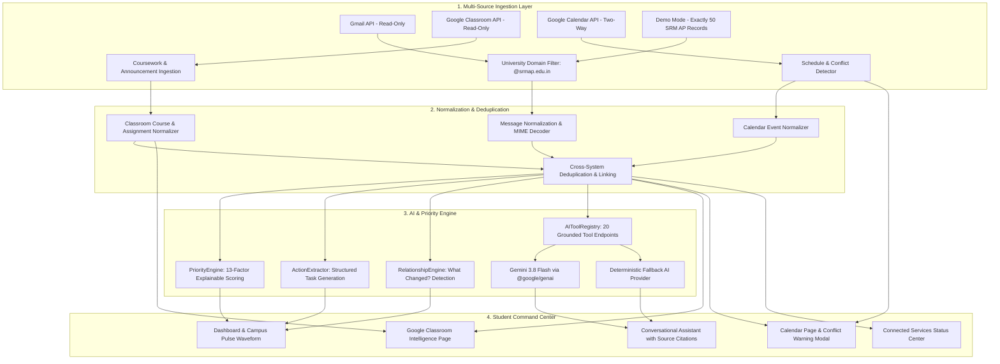

# 🎓 CampusPulse AI — SRM University-AP Edition
### *"Your campus. Prioritized."*

> **Smart India Hackathon / University Innovation Demonstration**  
> **Problem Statement:** PS02 — *"When Systems Don't Understand Each Other"*  
> **Institution:** SRM University-AP, Andhra Pradesh  
> **Campus:** Neerukonda, Mangalagiri Mandal, Guntur District, Andhra Pradesh 522240  
> **Tagline:** *"Your campus. Prioritized."*  

---

## 📌 Problem Statement (PS02): "When Systems Don't Understand Each Other"

In modern universities, essential student information is severely fragmented across disconnected silos:
- **Gmail:** Urgent circulars, exam relocations, rain closure advisories, fee deadlines, club recruitments.
- **Google Classroom:** Assignment postings, quiz announcements, rubrics, and submission tracking.
- **Google Calendar:** Personal lectures, project reviews, and exam slots.
- **Administrative Portals:** Transport schedules, hostel mess advisories, and condonation requirements.

### Why Existing Solutions Fail
1. **Email Overload:** Important notifications get buried among newsletters and routine announcements.
2. **Disconnected Context:** A Google Classroom assignment is announced, an email notification is sent, and an exam is rescheduled in another email—yet no system connects them.
3. **No Explainable Priority:** Students miss deadlines because emails are ranked merely by timestamp.
4. **Hallucination Risk:** Generic AI chat bots invent faculty, room numbers, and dates when answering student questions.

---

## ⚡ The CampusPulse AI Intelligence Layer

CampusPulse AI acts as a **unified student communication intelligence layer**. The student connects their Google account once, and CampusPulse:
1. **Reads relevant university Gmail messages** (Read-Only).
2. **Reads Google Classroom courses, coursework, and announcements** (Read-Only).
3. **Reads Google Calendar events** and identifies conflicts.
4. **Extracts deadlines, actionable tasks, room changes, and schedule shifts**.
5. **Prioritizes what matters to the student** using an explainable 13-factor priority engine.
6. **Cross-links related information across different systems** (e.g. linking Classroom assignment notifications in Gmail directly to the corresponding Classroom coursework).
7. **Answers student questions using 20 grounded retrieval tools** (`searchEmails`, `getUpcomingDeadlines`, `getClassroomAssignments`, `getTodaySchedule`, `checkCalendarConflict`, etc.) with interactive source citations.
8. **Explicit Google Calendar Creation:** Checks for schedule overlaps and duplicates, displays a conflict warning modal, and creates the calendar event *only after explicit student confirmation*.
9. **Provides a pristine Demo Mode** with **EXACTLY 50 high-quality SRM AP communications** covering all realistic scenarios without needing Google credentials.

---

## 🏗️ System Architecture



---

## 🔐 Google OAuth Architecture & Security

CampusPulse AI implements **strict server-side OAuth 2.0**.
- **One Google Login:** A single authorization screen authorizes all required read-only and calendar creation permissions.
- **Server-Side Token Storage:** Refresh tokens and access tokens are held securely in server memory and are **never** returned to the frontend or stored in `localStorage`.
- **Zero Client Secrets in React:** Frontend code only interacts with the backend session API.
- **Read-Only Enforced:** Gmail and Google Classroom APIs are strictly read-only (`gmail.readonly`, `classroom.courses.readonly`, `classroom.coursework.me.readonly`, `classroom.announcements.readonly`). CampusPulse cannot modify, send, or delete student emails or coursework.
- **Explicit Confirmation for Calendar:** CampusPulse **never** silently creates Google Calendar events. Event creation occurs only after conflict/duplicate verification and explicit confirmation.

### Required OAuth Scopes
- `openid`
- `email`
- `profile`
- `https://www.googleapis.com/auth/gmail.readonly`
- `https://www.googleapis.com/auth/classroom.courses.readonly`
- `https://www.googleapis.com/auth/classroom.coursework.me.readonly`
- `https://www.googleapis.com/auth/classroom.announcements.readonly`
- `https://www.googleapis.com/auth/classroom.student-submissions.me.readonly`
- `https://www.googleapis.com/auth/calendar.events`

---

## 🛠️ Technology Stack

| Layer | Technologies Used |
| :--- | :--- |
| **Frontend** | React 19, TypeScript, Vite 8, Tailwind CSS v4, Lucide Icons, Recharts |
| **Backend API** | Node.js v24, Express, TypeScript, `tsx`, `googleapis`, `sanitize-html` |
| **AI Integration** | Google GenAI SDK (`@google/genai`), `gemini-3.8-flash`, Grounded Function Calling & Retrieval |
| **Fallback AI** | Deterministic Regex & Heuristic Rule Engine (100% offline capability) |
| **Security** | Server-side OAuth token store, Strict Domain Filtering (`@srmap.edu.in`), Sanitized HTML rendering |
| **Integrations** | Google Cloud Gmail API, Google Classroom API, Google Calendar API, Google Maps |

---

## ⚙️ Environment Variables

Configure your local `.env` in the project root (never commit secrets to version control):

```env
PORT=3001
NODE_ENV=development
CLIENT_URL=http://localhost:5173

# Application Mode: demo | gmail
APP_MODE=demo

# AI Provider: gemini | mock
AI_PROVIDER=gemini
GEMINI_API_KEY=your_gemini_api_key_here
GEMINI_MODEL=gemini-3.8-flash

# University Domain Filter (Comma-separated)
ALLOWED_UNIVERSITY_DOMAINS=srmap.edu.in

# Google OAuth Credentials
GOOGLE_CLIENT_ID=your_google_client_id_here
GOOGLE_CLIENT_SECRET=your_google_client_secret_here
GOOGLE_REDIRECT_URI=http://localhost:3001/api/google/oauth/callback

# Google Maps API (Optional for enhanced live map rendering)
GOOGLE_MAPS_API_KEY=
```

---

## 🚀 Running the Project Locally

### 1. Install Dependencies
```bash
npm install
npm --prefix server install
npm --prefix client install
```

### 2. Run Tests
CampusPulse AI includes 20 comprehensive unit and integration tests:
```bash
npm test
```

### 3. Build for Production
```bash
npm run build
```

### 4. Start the Application
Run both backend and frontend concurrently:
```bash
npm run dev
```
- **Frontend Command Center:** [http://localhost:5173](http://localhost:5173)
- **Backend API Server:** [http://localhost:3001](http://localhost:3001)

---

## 🏆 Judge Demonstration Flow (SIH PS02)

1. **Immediate Out-of-the-Box Value (No Setup Required):**
   - Open [http://localhost:5173](http://localhost:5173).
   - Dashboard instantly displays student profile (Muthu, B.Tech CSE AI & ML, Sem 3), real-time Campus Pulse waveform, and top priorities.
2. **Transparent Priority Reasoning:**
   - Click on the CRITICAL alert for **CSE 204 Exam Venue Change**.
   - Review AI Summary, "Why It Matters" (Academic consequence, less than 24 hours remaining, venue relocated to S202 SR Block), and extracted action item.
3. **Cross-System "What Changed?" Engine:**
   - Navigate to **What Changed?** in the sidebar.
   - Observe detected logistics changes: Sept 24 3:00 PM early closure (rain disruption), Sept 25 closure with Oct 10 compensatory working day, STARTUP WARS postponement, and Bus Route 5/8 diversions.
4. **Google Classroom Intelligence:**
   - Open **Google Classroom** page.
   - Inspect active enrolled courses (CSE 213, CSE 204, CEL 101, CSE 207), upcoming assignments with countdown tags, and click **Linked Gmail Notice** to open the associated notification email.
5. **Grounded AI Assistant with Tool Retrieval:**
   - Click the bottom-right **Ask CampusPulse** floating button or open **AI Assistant**.
   - Ask: *"What do I need to do today?"*
   - Ask: *"Which assignments are due this week?"*
   - Ask: *"Was the class or event postponed?"*
   - Observe how the assistant dynamically calls `AIToolRegistry` tools and displays interactive **Grounded Source Citations** (Gmail, Classroom, Calendar) rather than hallucinating.
6. **Conflict-Protected Google Calendar Event Creation:**
   - Navigate to **Calendar & Conflict**.
   - Under AI-Detected Campus Events, find **CSE Expert Talk: Securing Autonomous AI Platforms**.
   - Click **[ Add to Google Calendar ]**.
   - A modal performs real-time duplicate and conflict checking against scheduled campus events.
   - Click **[ Confirm & Add to Calendar ]** to safely schedule the event.
7. **Connected Accounts & Live Google Sync:**
   - Navigate to **Connected Accounts**.
   - Review the status of Google Account, Gmail, Classroom, Calendar, Gemini 3.8 Flash, and Campus Map.
   - Click **[ Connect Google ]** to test the OAuth flow or click **[ Sync Everything ]** to run the complete ingestion, deduplication, and AI priority recalculation pipeline.

---

## 🧪 Testing & Verification

The test suite (`server/test/priorityEngine.test.ts`) verifies:
1. **Gmail normalization:** Base64 MIME decoding and header extraction.
2. **Gmail deduplication & idempotency:** Repeated syncs do not create duplicate records.
3. **University filtering:** Institutional domain verification and Classroom notification whitelisting.
4. **Classroom normalization:** Active courses, coursework due dates, and announcement linking.
5. **Calendar conflict detection:** Overlapping time window calculation.
6. **Calendar duplicate prevention:** Prevents identical event insertion.
7. **Priority calculation:** 13-factor explainable scoring.
8. **Action extraction:** Actionable task generation with deadlines.
9. **Relationship detection:** Topic clustering and schedule change detection.
10. **Demo dataset count:** Confirms EXACTLY 50 high-quality SRM AP communications.
11. **AI tool retrieval:** Dynamic tool execution through `AIToolRegistry`.
12. **Source grounding:** Traceable citations attached to AI answers.

Run tests anytime with:
```bash
npm test
```
